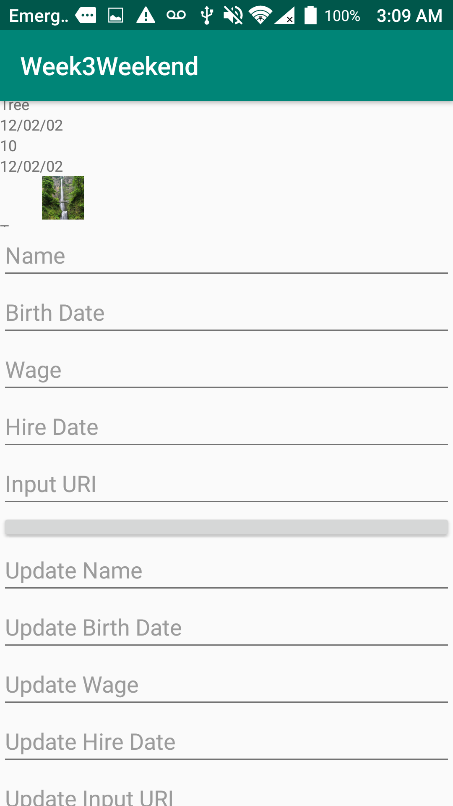
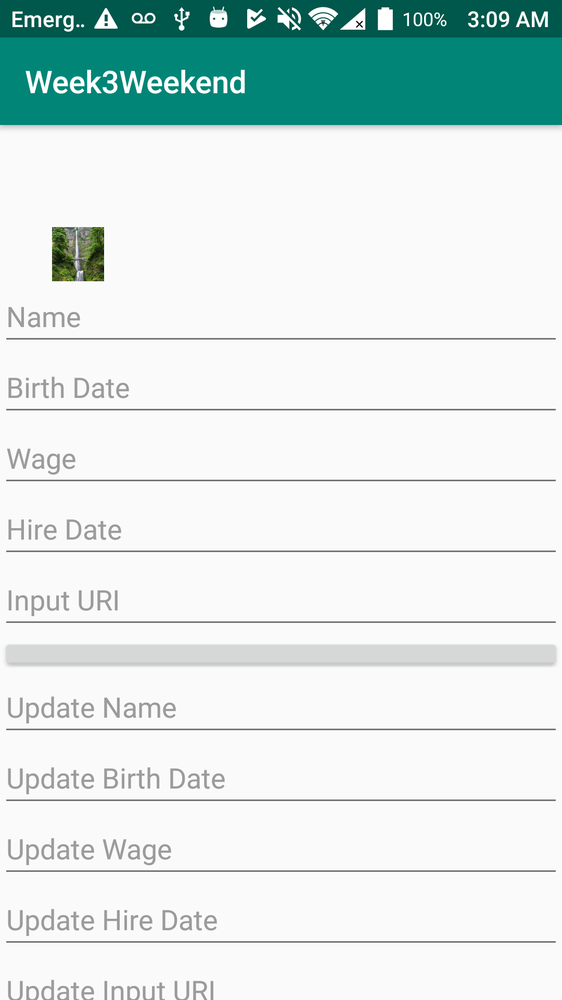

# Week3Weekend
New Project

1. Create an sql database that holds the following information:
a. employeeName
b.employeeBirthDate
c. employee Wage
d. employeeHireDate
e. employeeImage
2. Create an application with 3 fragments
a. First fragment will have a recycler view that will display all entries
b. Second Fragment will insert a new employee
c. Third Fragment will aloow for finding a single employee, updating that employee's info, or deleting the employee
3. Create a way to navigate between each fragment
4. Use Glide for the images

First Picture

Second Picture

